# Implementation Plan:

## Overview

This implementation plan updates the Subtraction Within 100 application's UI/UX to match the Reference_Module (numberbound) design system while preserving all subtraction-specific content and functionality.

## Tasks

- [x] 1. Create the foundational CSS design token files with all color, typography, spacing, shadow, and animation tokens matching the Reference_Module exactly (Create `src/styles/tokens.css` with all CSS custom properties, define color tokens, typography tokens, spacing tokens, shadow and effect tokens, transition and animation timing tokens, import tokens.css in App.css, verify tokens are accessible in browser DevTools)

- [x] 2. Create a centralized animations.css file with all keyframe animations used throughout the application (Create `src/styles/animations.css`, implement fadeIn/bounceIn/slideUp/shake/correctPulse/pulse/floatUp/slideInRight/fadeOut/floatAround keyframes, add prefers-reduced-motion media query support, import animations.css in App.css, test each animation works correctly) [depends on: 1]

- [x] 3. Extract common component patterns (buttons, cards, progress indicators) into a shared components.css file (Create `src/styles/components.css`, define .glass-card and variants, define .btn base styles and all variants, define .btn size variants, define progress indicator styles, define HUD component styles, import components.css in App.css, remove duplicate styles from existing component files) [depends on: 1, 2]

- [x] 4. Update App.css with the exact gradient background, floating numbers animation, and global resets matching Reference_Module (Update html/body background to gradient, update FloatingNumbers component styles, apply CSS reset and base styles, update .app-container layout styles, ensure smooth scroll behavior, test background renders correctly across all phases) [depends on: 1, 2]

- [ ] 5. Update TopBar component to match Reference_Module journey bar design with exact positioning, dot styling, and connector lines (Update journey bar position, apply glassmorphism background, update dot styling with active/completed/inactive states, update connector lines between dots, add phase labels below dots, hide labels on mobile, reduce dot size to 24px on mobile, test all phase states) [depends on: 1, 3]

- [ ] 6. Create a reusable Button component or update all button usage to use the new design token system with exact Reference_Module styling (Update all primary/secondary/outline buttons, apply hover/active/disabled effects, ensure minimum 44×44px touch targets, update button typography, test all button variants across all phases, verify button animations are smooth) [depends on: 1, 3]

- [ ] 7. Update IntroScreen to match Reference_Module intro design with exact badge, title, description, and journey preview styling (Update module badge styling, title styling, description styling, "Start Journey" button with bounceIn animation, journey preview card with 5 phase icons, audio toggle control styling, test mobile responsiveness, verify animations trigger correctly) [depends on: 1, 2, 3, 6]

- [ ] 8. Update WonderPhase to match Reference_Module wonder design with purple gradient icon, glow effect, and animation sequence (Update wonder question mark icon, add glowing aura with radial-gradient and pulse animation, update mascot entrance animation, update question card glassmorphism, update curiosity emoji size, update "Let's Find Out" button, implement animation sequence timing, test all animations play in correct order) [depends on: 1, 2, 3, 6]

- [ ] 9. Update StoryPhase to match Reference_Module story card design with glass effect, progress bar, image section, and navigation dots (Update story card glass effect styling, progress bar with gold-purple gradient, image section with gradient overlay, story title styling, add story text fade-in and slide-up animation, update navigation dots styling, add panel transition flip animation, test story progression, verify Lily & Max content preserved) [depends on: 1, 2, 3, 6]

- [ ] 10. Update SimulatePhase header, tip box, and station progress indicator to match Reference_Module styling (Update simulate phase header, station progress dots for 3 stations, tip box styling, apply glassmorphism to station containers, test station progress indicator state changes, verify tip text displays correctly) [depends on: 1, 3]

- [ ] 11. Update Station A (Base-10 blocks) to match Reference_Module block styling and animations (Update tens rods styling with vertical lines, update ones cubes styling, apply bounceIn animation when blocks added, update blocks area layout, update column labels, enable drag interaction, update equation display, test block manipulation, verify subtraction logic preserved) [depends on: 1, 2, 10]

- [ ] 12. Update Station B (Fact Family Triangle) to match Reference_Module triangle styling and drag-drop interaction (Update triangle SVG styling, update dashed circle for missing number, update drag-and-drop interaction styling, apply lock-click animation, display all 4 related facts, update triangle dimensions, test drag-and-drop interaction, verify fact family content preserved) [depends on: 1, 2, 10]

- [ ] 13. Update Station C (Number Inverter) to match Reference_Module keypad styling (Update number pad layout to 3×4 grid, update cell styling, add gold border on hover, update equation display area, apply checkmark animation on station completion, test number entry interaction, verify inverse operation logic preserved) [depends on: 1, 2, 10]

- [ ] 14. Update WorldMap component to match Reference_Module world card design with exact theme colors and state styling (Update world map layout, world card glassmorphism styling, implement world card states, add hover effect for unlocked worlds, apply locked/completed state styling, add world connectors, apply exact theme colors for all 10 worlds, test world unlock progression) [depends on: 1, 2, 3]

- [ ] 15. Update QuestionCard component to match Reference_Module question styling with exact feedback animations (Update question card glassmorphism, question text typography, options grid layout, option button states, apply correctPulse animation for correct answers, apply shake animation for wrong answers, update hint text styling, test all answer feedback scenarios, verify question content preserved) [depends on: 1, 2, 3, 6]

- [ ] 16. Update gamification HUD (XP counter, streak, hearts) to match Reference_Module styling and add floating XP popup (Update HUD layout, XP counter pill styling, streak counter with pulse animation, hearts display, create floating XP popup component, apply bounceIn + floatUp animations, update world badge styling, test XP earning and popup display, test streak counter activation, test hearts decrement) [depends on: 1, 2, 3]

- [ ] 17. Create WorldCompleteModal to match Reference_Module completion modal with star animation sequence (Create modal with glassmorphism styling, add bounceIn entrance animation, display celebration icon and title, display score fraction, implement sequential star animation, display earned XP, add action buttons, implement unlock gate logic, test modal appearance and animations, test button interactions) [depends on: 1, 2, 3, 6]

- [ ] 18. Update BadgeToast component to match Reference_Module toast styling with slide-in and auto-dismiss animations (Update toast position, toast styling with glassmorphism, apply slideInRight entrance animation, apply fadeOut exit animation after 3 seconds, update badge icon size, update badge name typography, implement badge queue, set z-index to 250, test single badge display, test multiple badges queue, verify badge audio plays) [depends on: 1, 2, 3]

- [ ] 19. Update ReflectPhase to match Reference_Module journal interface with exact card and option styling (Update reflect card glassmorphism and slideUp animation, reflect question title, mascot and speech bubble styling, reflection options layout, option styling with selected state, update "Next Question" button, update question counter, update "Complete Journey" button, test reflection question progression, verify reflection content preserved) [depends on: 1, 2, 3, 6]

- [ ] 20. Update ResultsScreen to match Reference_Module results design with celebration theme and confetti effects (Update results screen layout, display trophy icon, update "Journey Complete!" title, create XP circle badge, apply bounceIn animation to XP circle, update earned badges grid, display phase completion checkmarks, update action buttons, add confetti/particle effects, test results display with various XP amounts, verify all badges display correctly) [depends on: 1, 2, 3, 6]

- [ ] 21. Apply mobile-specific responsive adjustments to all components for screens under 768px width (Apply single-column stacked layout, hide sidebar navigation, reduce horizontal padding to 16px, update question options to single column grid, reduce button padding, stack navigation buttons vertically, reduce font sizes, hide phase labels when width < 600px, reduce mascot size to 60px when width < 480px, test all phases on mobile viewport, test touch interactions, verify minimum 44×44px touch targets) [depends on: 5, 6, 7, 8, 9, 10, 11, 12, 13, 14, 15, 16, 17, 18, 19, 20]

- [ ] 22. Apply tablet-specific responsive adjustments for medium-sized screens (Enable 2-column layout, show sidebar with phase map, increase content padding, maintain 2-column question options grid, apply larger interactive elements, test all phases on tablet viewport, test orientation changes) [depends on: 21]

- [ ] 23. Apply desktop-specific responsive adjustments for large screens (Apply wide layout with increased spacing, set max content width to 900px, apply larger visual elements, enhance animations and hover effects, implement fluid typography using clamp(), test all phases on desktop viewport at 1024px and 1920px, verify layout scales properly) [depends on: 22]

- [ ] 24. Ensure all components meet WCAG 2.1 Level AA accessibility standards (Verify all interactive elements have minimum 44×44px touch targets, verify color contrast ratios 4.5:1 for normal text and 3:1 for large text, implement keyboard navigation for all interactive elements, add visible focus indicators, add aria-label attributes to icon-only buttons, implement proper heading hierarchy, add aria-live regions for dynamic content changes, test with keyboard-only navigation, run axe DevTools audit, fix all accessibility violations) [depends on: 5, 6, 7, 8, 9, 10, 11, 12, 13, 14, 15, 16, 17, 18, 19, 20]

- [ ] 25. Implement prefers-reduced-motion support to disable animations for users with motion sensitivity (Add @media prefers-reduced-motion: reduce media query, disable all animations and use instant transitions, set animation-duration to 0.01ms, set transition-duration to 0.01ms, test with reduced motion preference enabled in OS, verify all interactions still work without animations) [depends on: 24]

- [ ] 26. Optimize application performance to meet Reference_Module performance standards (Implement lazy loading for phase components using React.lazy(), preload critical assets, compress audio files to 128kbps MP3, optimize images using WebP format where supported, debounce rapid user interactions, apply React.memo() to expensive components, achieve Lighthouse performance score > 90, achieve First Contentful Paint < 1.5s, achieve Time to Interactive < 3s, verify production bundle size < 500KB gzipped excluding audio) [depends on: 5, 6, 7, 8, 9, 10, 11, 12, 13, 14, 15, 16, 17, 18, 19, 20]

- [ ] 27. Test application across multiple browsers and fix any browser-specific issues (Test on Chrome 100+, Firefox 100+, Safari 15+, Edge 100+, fix any browser-specific CSS issues, verify glassmorphism effects work with fallback for unsupported browsers, verify all animations work across browsers, test audio playback across browsers, document any known browser limitations) [depends on: 26]

- [ ] 28. Compare visual output with Reference_Module and fix any discrepancies (Take screenshots of all phases in the current implementation, take screenshots of Reference_Module for comparison, compare color values/font sizes/spacing/shadows, document all visual differences, fix identified discrepancies, perform final side-by-side comparison, get stakeholder approval on visual consistency) [depends on: 27]

- [ ] 29. Verify that all subtraction-specific content has been preserved unchanged during UI/UX updates (Verify all 100 questions are intact in questionBank.js, verify Lily & Max story content is unchanged with 6 panels, verify 10 themed worlds are unchanged, verify fact family triangle logic works correctly, verify base-10 blocks interaction works correctly, verify badge system works with 6 badges, verify gamification rules unchanged, test complete user journey from intro to results, verify session state persistence works for 24-hour resume) [depends on: 5, 6, 7, 8, 9, 10, 11, 12, 13, 14, 15, 16, 17, 18, 19, 20]

- [ ] 30. Perform comprehensive end-to-end testing and prepare for deployment (Complete full user journey test from intro to wonder to story to simulate to play to reflect to results, test all 10 worlds progression, test badge earning scenarios, test audio integration with narration and sound effects, test session persistence save and resume, test error handling and edge cases, run final Lighthouse audit, run final axe DevTools accessibility audit, create deployment checklist, document any post-deployment monitoring requirements, get final stakeholder approval) [depends on: 28, 29]

## Notes

- All tasks must preserve existing subtraction-specific content and functionality
- Design tokens should exactly match the Reference_Module (numberbound) design system
- All components must be tested for mobile, tablet, and desktop responsiveness
- WCAG 2.1 Level AA accessibility compliance is required throughout
- Performance targets: Lighthouse score > 90, FCP < 1.5s, TTI < 3s

## Task Dependency Graph

```json
{
  "waves": [
    [1],
    [2],
    [3, 4],
    [5, 6],
    [7, 8, 9, 10],
    [11, 12, 13, 14, 15, 16, 17, 18, 19, 20],
    [21],
    [22],
    [23],
    [24],
    [25],
    [26],
    [27],
    [28, 29],
    [30]
  ]
}
```

```mermaid
graph TD
    T1[1. Create Design Token System]
    T2[2. Create Animation Keyframes Library]
    T3[3. Create Reusable Component Styles]
    T4[4. Update Global Styles and Background]
    T5[5. Refactor TopBar/Journey Bar]
    T6[6. Refactor Button Components]
    T7[7. Refactor IntroScreen]
    T8[8. Refactor WonderPhase]
    T9[9. Refactor StoryPhase]
    T10[10. Refactor SimulatePhase - Station Progress]
    T11[11. Refactor SimulatePhase - Station A]
    T12[12. Refactor SimulatePhase - Station B]
    T13[13. Refactor SimulatePhase - Station C]
    T14[14. Refactor PlayPhase - WorldMap]
    T15[15. Refactor PlayPhase - QuestionCard]
    T16[16. Refactor Gamification HUD]
    T17[17. Create WorldCompleteModal]
    T18[18. Refactor BadgeToast]
    T19[19. Refactor ReflectPhase]
    T20[20. Refactor ResultsScreen]
    T21[21. Responsive Design - Mobile]
    T22[22. Responsive Design - Tablet]
    T23[23. Responsive Design - Desktop]
    T24[24. Accessibility - WCAG AA]
    T25[25. Accessibility - Reduced Motion]
    T26[26. Performance Optimization]
    T27[27. Cross-Browser Testing]
    T28[28. Visual Regression Testing]
    T29[29. Content Preservation Verification]
    T30[30. Final Integration Testing]

    T1 --> T2
    T1 --> T3
    T2 --> T3
    T1 --> T4
    T2 --> T4
    T1 --> T5
    T3 --> T5
    T1 --> T6
    T3 --> T6
    T1 --> T7
    T2 --> T7
    T3 --> T7
    T6 --> T7
    T1 --> T8
    T2 --> T8
    T3 --> T8
    T6 --> T8
    T1 --> T9
    T2 --> T9
    T3 --> T9
    T6 --> T9
    T1 --> T10
    T3 --> T10
    T1 --> T11
    T2 --> T11
    T10 --> T11
    T1 --> T12
    T2 --> T12
    T10 --> T12
    T1 --> T13
    T2 --> T13
    T10 --> T13
    T1 --> T14
    T2 --> T14
    T3 --> T14
    T1 --> T15
    T2 --> T15
    T3 --> T15
    T6 --> T15
    T1 --> T16
    T2 --> T16
    T3 --> T16
    T1 --> T17
    T2 --> T17
    T3 --> T17
    T6 --> T17
    T1 --> T18
    T2 --> T18
    T3 --> T18
    T1 --> T19
    T2 --> T19
    T3 --> T19
    T6 --> T19
    T1 --> T20
    T2 --> T20
    T3 --> T20
    T6 --> T20
    T5 --> T21
    T6 --> T21
    T7 --> T21
    T8 --> T21
    T9 --> T21
    T10 --> T21
    T11 --> T21
    T12 --> T21
    T13 --> T21
    T14 --> T21
    T15 --> T21
    T16 --> T21
    T17 --> T21
    T18 --> T21
    T19 --> T21
    T20 --> T21
    T21 --> T22
    T22 --> T23
    T5 --> T24
    T6 --> T24
    T7 --> T24
    T8 --> T24
    T9 --> T24
    T10 --> T24
    T11 --> T24
    T12 --> T24
    T13 --> T24
    T14 --> T24
    T15 --> T24
    T16 --> T24
    T17 --> T24
    T18 --> T24
    T19 --> T24
    T20 --> T24
    T24 --> T25
    T5 --> T26
    T6 --> T26
    T7 --> T26
    T8 --> T26
    T9 --> T26
    T10 --> T26
    T11 --> T26
    T12 --> T26
    T13 --> T26
    T14 --> T26
    T15 --> T26
    T16 --> T26
    T17 --> T26
    T18 --> T26
    T19 --> T26
    T20 --> T26
    T26 --> T27
    T27 --> T28
    T5 --> T29
    T6 --> T29
    T7 --> T29
    T8 --> T29
    T9 --> T29
    T10 --> T29
    T11 --> T29
    T12 --> T29
    T13 --> T29
    T14 --> T29
    T15 --> T29
    T16 --> T29
    T17 --> T29
    T18 --> T29
    T19 --> T29
    T20 --> T29
    T28 --> T30
    T29 --> T30
```


